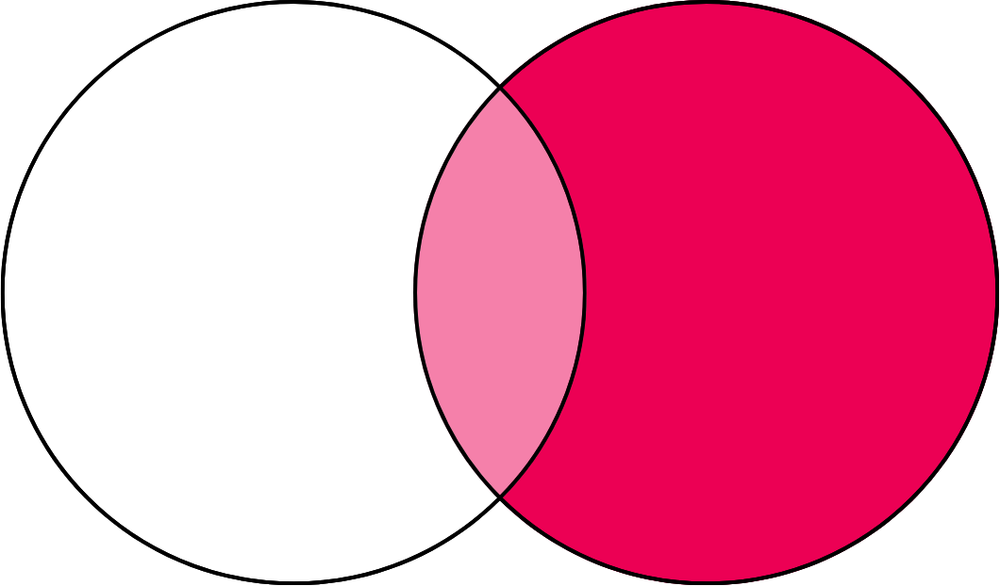
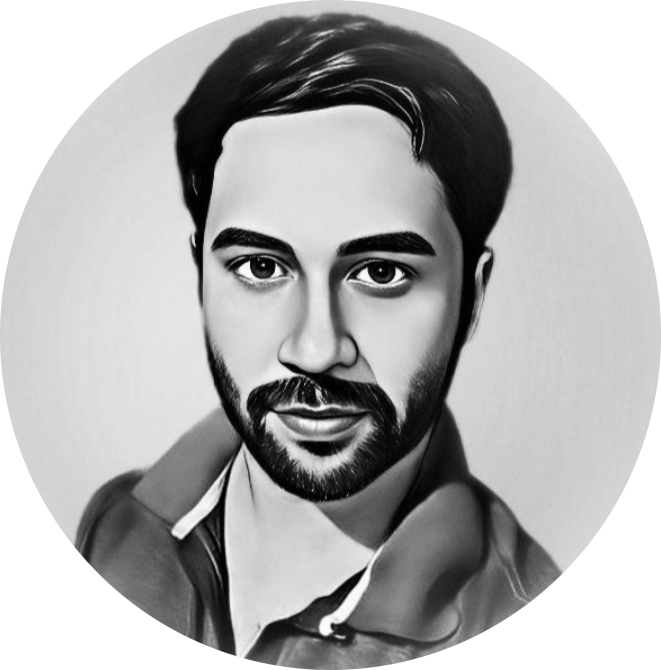

# 🏷️ [ৰিক্ত সংহতি | Rikto Xonghoti]

## 📍 Location
- **Country:** India
- **State:** Assam

## 📖 About Us
Rikto Xonghoti (ৰিক্ত সংহতি) is a project that aims to provide bitcoin education in the Assamese (অসমীয়া) language. We are translating articles, books etc to Assamese, creating our own content as well.

## 👥 Our Team

  <a href="https://twitter.com/anuragsaikia" target="_blank">
    
  
  

Anurag Saikia, Basanta Goswami and Pallab J D Goswami, from left to right, are the faces behind Xonghoti. Anurag and Basanta met over Twitter and decided to spread Bitcoin education within their community. In the process they ended up orange pilling Pallab who then made an effort to learn more about Bitcoin and now leads the efforts around the MPB diploma.

## 🎓 Graduations
We currently have our first cohort on going. It is expected to be over by the first week of March.

## 🏆 Recent Achievements

- We are in the process of translating the Bitcoin Whitepaper and book [21 Lessons](https://21lessons.com) by Dergigi to Assamese.
- We have held recorded spaces on Twitter discussing the whitepaper and every single concept behind it in details over multiple months.
- We hosted the first ever Bitcoin-only meetup of not only Assam but of entire North East India
- We hosted a Bitcoin themed quiz competition and workshop among high school kids and gave prizes in sats on children's day.
- We hosted an online seminar for younger kids in another state.
- We became the first light node of MPB in India and started providing the diploma.

## 📞 Contact Information
- **Website:** https://xonghoti.com
- **Email:** hello@xonghoti.com
- **Twitter:** [@xonghoti](https://twitter.com/xonghoti)
- **Nostr:** [@xonghoti.com](https://njump.me/npub1dy2t2h6xphjqqyqm8thp3m2c0fka8ekzgxjjdm475lzm8xtpzxlqdzcv99)
- **Telegram:** https://t.me/+0eqTygvzmx03ZTc1

## 💰 Official Donation Link

- You can send sats to `xonghoti@geyser.fund` to help us further our cause.
- Alternatively you can display your support publicly at our [Geyser.fund project page](https://geyser.fund/project/xonghoti).
