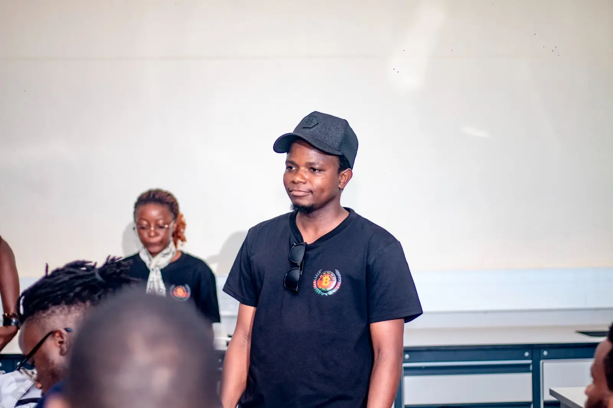
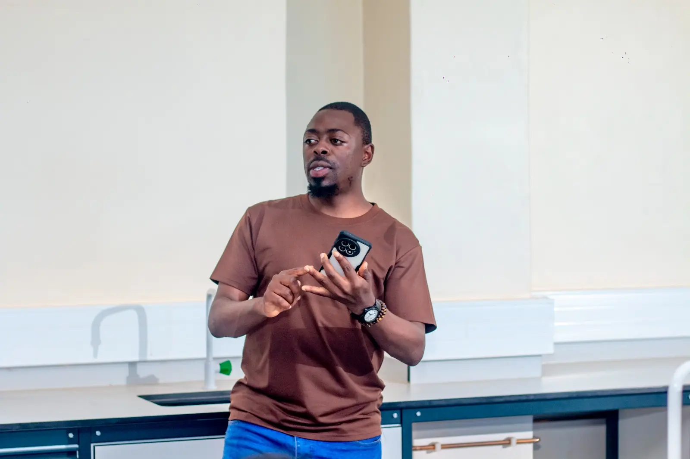
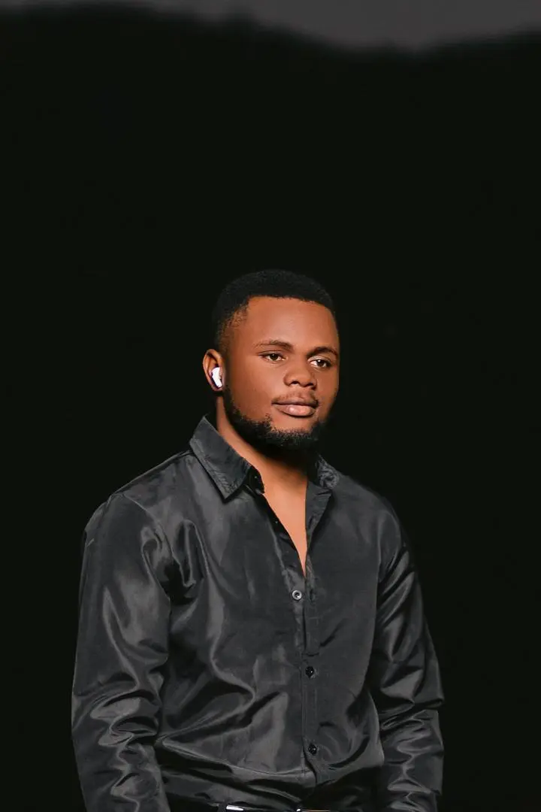
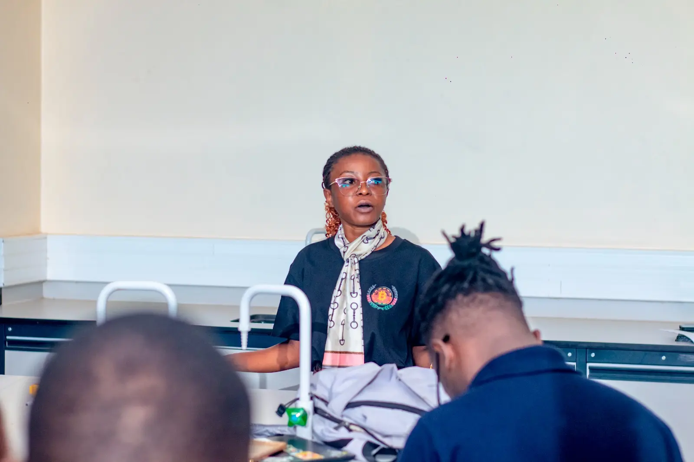

# 🏷️ Bitcoin Boma
 <!-- 1 picture maximum -->

## 📍 Location
- **Country:** Malawi
- **City:** Lilongwe

## 📖 About Us
Bitcoin Boma is a Bitcoin non-profit organization based in Malawi. Our primary focus is fostering Bitcoin education, advancing financial literacy, grass root adoption, financial human rights, and economic empowerment through credible Bitcoin ecosystem development.

Our philosophy is based on principles of freedom , sound money and free markets through community building insertion of skills, knowledge and financial literacy of Bitcoin. We believe the best investment Malawi has is it's own financial education, sovereignty and the power of saving for the future. Throughout history prosperity of civilizations arises from acts of Free markets from our local farmers, traders, merchants, hawkers, small and medium retailers who are the backbone of Malawi's economy. We aim to reach with a banner of hope and  solidarity with the right practical knowledge and tools required to engage with Bitcoin as an open source, permissionless monetary infrastructure.

Bitcoin Boma positions itself as non-speculative, neutral and education-first organization, committing its resources to a long-term strategy and  capacity building. 

Mission
Raising the social, economic and environmental benefits of Bitcoin literacy and it's practical use case in Malawi. 

We aim to achieve this mission by providing a resource hub of education and empower Malawians with credible Bitcoin knowledge and practical skills that enable financial self-sovereignty, economic resilience, and participation in the global digital economy.

Vision
A Malawi that has a decentralized education infrastructure that allows Bitcoin education from Grass roots to the urban. As future African communities are making strides in financially sovereignty, economically resilience by finding alternatives to a central planned inflatory currency, Malawi has the great potential of it's lake, minerals, fish, precious resources to benefit with integration of sound money. This is achievable only through the right financial literacy and Bitcoin is the compass pointing Malawi to the right  direction of its financial destiny.

*Core Values:*
Financial Education: Educating Malawians on the right knowledge of money and Bitcoin.

Financial Independence: 

Promoting full custodial ownership, control, saving and personal responsibility to 
open & Permissionless Systems: Supporting censorship-resistant financial infrastructure
Education Before Adoption: Prioritizing understanding over usage. 

Neutrality & Integrity: Non-political, non-partisan, and non-speculative approach
Community-Led Growth: Local empowerment with global alignment

*Strategic Objectives:*

Delivering credible Bitcoin education tailored to the Malawian context and reality.
Building sustainable Bitcoin circular economies at the community level
Support youth, developers, and entrepreneurs entering the Bitcoin ecosystem
Serve as a trusted local partner for global Bitcoin organizations operating in Africa
Contribute African perspectives to global Bitcoin discourse

Key Programs & Initiatives:

*1. Bitcoin Boma Bitcoin Diploma*
A structured, cohort-based Bitcoin education program designed for learners aged 15–55.
A ten-week curriculum covering Bitcoin fundamentals from the basics of money, Transition of money from: Barter to paper bills and currency to introduction to Bitcoin,  self-custody, Lightning, security, and practical use cases. 

This is Delivered through online learning platforms with live virtual sessions
Designed to meet global education standards while addressing Malawian socio-economic contexts. 

Graduates are prepared for further specialization, entrepreneurship, or professional roles in the Bitcoin industry. 

*2. Bitcoin Meet ups*
A fun exposure, meet and greet for Bitcoin where we meet up based on awareness campaigns, physical meet ups at any open spaces through Malawi from Lilongwe and open to all market days, centres, across Malawi.

We conduct monthly educational and community-building events
Targeting students, professionals, entrepreneurs, and policymakers. These meet ups facilitate, critical thinking, and practical Bitcoin literacy where we use lightning wallets and how one can have a Point of Sale for Bitcoin. 

*3. Bitcoin Circular Economy Program*

Bitcoin Boma aims to create a  community-based initiative to support Bitcoin usage among merchants and individuals.
Merchant education and onboarding
Peer-to-peer usage training
Emphasis on spend-and-receive, not speculation
Designed to strengthen local economic resilience

*4. Partnerships*
Bitcoin Boma is growing a cross-border Bitcoin outreach and partnership initiative across Africa and the globe.

Bitcoin Boma Became a light node through its partnership with My First Bitcoin. Bitcoin Boma uses Educational resources, virtual learning platforms and interacts with Bitcoin Educators around the world learning, sharing and acquiring collective tool kits for the best Bitcoin teaching and learning. 
 
Through monthly node General assemblies organized by My First Bitcoin, we share 
knowledge exchange with tutors, local Bitcoin communities.

*5. Bitcoin Boma Office (Planned)*
A physical space where one can buy a coffee using Bitcoin. This will be gallery for Bitcoin merch ranging from Hardware wallets, clothes, Point of Sale Bitcoin machines and restaurant where anything is completely Bitcoin. The space will be modded for Developer education, tooling Research and experimentation on Bitcoin applications relevant to Malawian  markets Support for open-source contributions

## 👥 Our Team

Co-founder and Executive Director:
Mr. Grant Gombwa*

Bitcoin educator and Programs Manager: 
Mr. Pacharo Nyirenda

Finance Director:
Mr. Victor Siliya

Media Coordinator
Miss Mariana Pachanya

##  Bitcoin Boma Structure 

Currently operates with a lean leadership model, supported by volunteers and strategic collaborators such as Women of Satoshi, led by Thandie Ngolleka,  Bit-Devsmw led by Founder Yankho Ngolleka, Study Hubs Malawi, led by Founder  Kondwani Konyani, Olev Maimets, tutor and Guide for Bitcoin Boma. 
We also cannot fail to mention collaborators such as Trezor Academy, FEDI, The Core led by  Felix Mukungu Founder, Bitcoin Ubuntu, led by Glen Dutsee, Founder.

 We have plans for  expansion to formal governance structures as funding and scale increase.

## 🎓 Graduations
- **Dates of Graduations:** Dates of Graduations:  
19th December, 2025

7th July, 2025

- **Number of Students Graduated:** 39

## 🏆 Recent Achievements
1. Conducted Bitcoin Education Development program at University of Malawi: Chancellor College, Computer Society March 23rd to 25th, 2026.

2. Currently conducting the Bitcoin Diploma Education program for Cohort 3, January- March 2026  with over 20 cohorts.

3. Graduated our Bitcoin Education Diploma second Cohorts for August-October 2025 on December 19th, 2025.
 
3. Collaborated with Women of Satoshi for onboard merchant and seminar in Mchinji District, Gumulila Village, T.A Mavwere.  November 15th, 2025
 
4. Bitcoin Meet up and Merchants onboarding workshop, September 27th, 2025 Hapuwani Court, Chitakale, Mulanje. 

5. Graduated our first Bitcoin Diploma Education program cohorts July, 7th 2025

5. Collaborated with Women of Satoshi, Bitcoin for her empowerment, led by Women of Satoshi, Crown Hotel, Thuchilla Hall, Lilongwe June 25th, 2025. 

6. Bitcoin Boma Bitcoin Pizza day celebration, Flavatos, Gateway Mall, May 31st 2025 sponsored by John Miller USA. 

7. Bitcoin Boma Education Development program The University of MUMBAS, Blantyre, April 26th, 3rd and 10th May, 2025

8. Embarked on the first Bitcoin Bitcoin Boma Diploma Education program with My First Bitcoin January 5th, 2025.

## 📞 Contact Information
- **Website:** 
- **Email:** bitcoinbomamw@gmail.com
- **WhatsApp:** +265886200854
- **Telegram:** 
- **Phone:** +26588 316 43 10

## 💰 Official Donation Link
Support our activities by donating through (https://geyser.fund/project/bitcoinboma).
