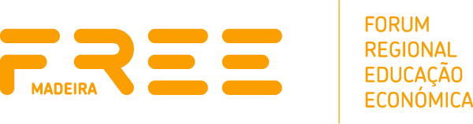

# 🏷️ FREE Madeira

## 📍 Location
- **Country:** Portugal
- **City:** Funchal, Madeira Island

## 📖 About Us
FREE Madeira is a non-profit organisation created in 2022, focused on Bitcoin adoption and education in the Madeira Archipelago. Our purpose is to help everyone transition to the new monetary paradigm, from large companies to small businesses, as well as individuals.

One of the main goals of FREE Madeira is to promote the education of the Madeiran community within the scope of Bitcoin. We have already organised several events in this regard, including an international conference with over 3,000 attendees, that included several educational workshops, including one made entirely in Portuguese.

We want to continue organising training sessions for individuals and companies, with the next one already scheduled for September 2024, taught entirely in Portuguese.

## 👥 Our Team
### Board of Directors
* André Loja
* Daniel Prince
* Knut Svanholm

### Advisory Board
* Gigi
* Greg Foss
* Jeff Booth
* Joe Hall
* Lawrence Lepard
* Lucinda Castro
* Max Hillebrand
* Obi Nwosu
* Pablo Fernandez
* Paulo Pereira
* Paulo Vieira
* Rob Brinded
* Samson Mow
* Troy Cross

### Local Team
* André – Director
* Charlie – Merchant Adoption and Social Media Manager
* Henrique – Education and Development Manager
* Luísa – Project Manager/Communication
* Mafalda – Project Manager

## 🎓 Graduations
- **Dates of Graduations:** (First Portuguese Course to be held in the 1st Quarter of 2025)
- **Number of Students Graduated:** N/A

## 🏆 Recent Achievements
### Bitcoin Atlantis 2024
The first edition of [Bitcoin Atlantis Conference](https://bitcoinatlantis.com) happened between 1–3 March 2024 and was produced by FREE Madeira. The conference marked a milestone as the first of its kind hosted in a football stadium, with a [family-friendly atmosphere](https://bitcoinatlantis.com/kids-block), and a dedicated [Book Corner programme](https://bitcoinatlantis.com/book-corner).

Featuring a rich agenda across 4 stages, 3 workshop rooms, 200 speakers, and an array of satellite events, the conference attracted over 3,000 attendees, united by a keen interest in Bitcoin and its potential to give freedom and empower individuals and businesses around the world.

Educational initiatives that occurred during the Conference week:

* **Bem-Vindo ao Bitcoin (Welcome to Bitcoin)**

	A Satellite Event dedicated to those who are new to Bitcoin, took place the day before the conference, entirely run in Portuguese and free to all who wanted to attend.

* **Workshop rooms inside the Conference:**
	* **Learning Bitcoin**
        
		A space shared by Mi Primer Bitcoin, Looking Glass Education and Amity Age, with a total of 27 educational sessions during the 3-day Conference.
        
	* **Workshop Sessions**
        
		Ben Perrin (BTC Sessions) shared his valuable insights in this practical workshop room.
        
	* **LNBits/MakerBits**
        
		A practical workshop room, where anyone was welcome to come in and learn how to build a hardware wallet.
        
* **Book Corner**
    
	The conference had a space dedicated to the most interesting books available for the Bitcoin Community, where authors were invited to present their books or discuss different topics related to Bitcoin. More than 20 book signings took place.
    

### FREE Madeira Meetups

Every first Thursday of the month, FREE Madeira organises a Bitcoin Meetup, bringing the community together to share their knowledge with their peers.

During the Meetups, we encourage developers to present their open-source projects. These Meetups happen mostly in Funchal, the capital city of Madeira Island, and we aim to start organising these meetings outside Funchal to reach all the population of Madeira. Usually, we choose a place that accepts Bitcoin to foment the payment in bitcoin.

We’ve organised monthly meetups since October 2022, and our [Meetup.com community](http://meetup.com/) has around 650 members. On average we have 50 participants per meeting.

Our biggest meetup so far took place during the Bitcoin Atlantis Conference, with a special meetup party gathering around 650 attendees.

### Merchant Adoption

Support local merchants on their Bitcoin journey, from initial adoption to ongoing troubleshooting. By accepting Bitcoin in their businesses, these merchants not only attract the community but also experience significant growth. We recommend various payment solutions tailored to their specific needs, which has led to overwhelmingly positive feedback. This word-of-mouth effect has drawn even more merchants to Bitcoin. Notably, around 80% of these merchants are choosing to keep their Sats, using Bitcoin as a store of value. Since its founding in late 2022, FREE Madeira has reached the mark of 100 merchants adopting Bitcoin, making the Madeiran community the second largest on BTCmap by August 2024.

### Book publishing

Through Monstera, a sister company, some of the most relevant books about Bitcoin are translated and published in Portuguese. Monstera’s catalogue also includes books on adjacent topics, such as economics and freedom. Titles published include “The Bullish Case for Bitcoin”, “The Price of Tomorrow”, “21 Lessons” and “The Sovereign Individual”.

## 📞 Contact Information
- **Website:** [www.freemadeira.com](https://www.freemadeira.com)
- **Email:** [info@freemadeira.org](mailto:info@freemadeira.org)
- **Telegram:** [https://t.me/freemadeira](https://t.me/freemadeira)

## 💰 Official Donation Link
Support our activities by donating to our Lightning address: **freemadeira@blink.sv**
